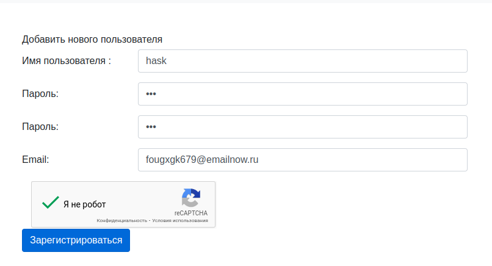
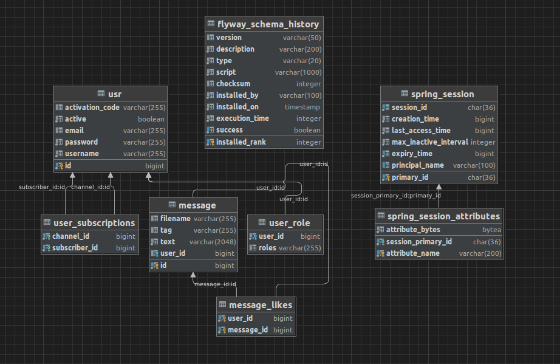

Описание:

Сервис для публикации постов(все CRUD-операции) с текстом и картинками, поиском постов по тегам.  Также для пользователей имеются подписки с подписчиками и лайками постов.  
Имеется админка для выдачи прав доступа пользователям. 
Приложение покрыто интеграционными и юнит тестами.

Идея: Уже писал похожий сервис на Java + Spring и увидел идею сервиса наподобие Twitter-постов у автора drucoder.  
У него были интересные фичи, которые я хотел понять и забрать в свою копилку опыта. За что огромная благодарность ему за это.  

Функциональность:

1. Пользователи могут зарегистрироваться и войти в систему с помощью почтового сервиса приложения.

2. Администратор может выдавать права пользователям

3. Общий список постов, которые можно также лайкать

4. Посты можно редактировать (доступно только для своих постов), удалять и искать по тегам все посты
5. Можно подписаться на пользователя, посмотреть его посты

6. Возможность редактирования почты и пароля.

Технологический стек:

- Backend: Java 17, Spring Boot
- Frontend: HTML, CSS, Freemarker + Turbolinks для ускорения и плавной загрузки страниц
- Database: PostgreSQL

Модель базы данных:

Как запустить сервис:
1. В application*.properties нужно добавить собственные креды для настройки почтового сервиса, чтобы почтовый сервис мог отправлять на почту зарегистрированным пользвоателям ссылку с активацией
2. Запускается через Application.java
3. Для авторизации под админом: Admin 123
4. На всякий случай добавлен бэкап БД Postgres (springmvcDB.backup)

# НА ДОРАБОТКУ:
- доработать удаление только своих постов, если роль USER. (Сделать как реализовано редактирование только своих постов под ролью User)
- добавить алерт с предупреждением перед удалением поста
- переделать форму регистрации (при последнем рефакторинге Spring Security не перенаправляет на страницу авторизации-регистрации. Приходится сейчас авторизовываться через стандартную админку сервиса. Чтобы сейчас зарегистрировать нового пользователя нужно явно вбивать строку адрес /registration (localhost:8080/registration)
- исправить ошибку с публикацией поста, когда отправляешь пост от страницы своих постов, а не от общей страницы постов.
- юнит тесты отрабатывают без ошибок, а интеграционные стали падать после обновления библиотеки
